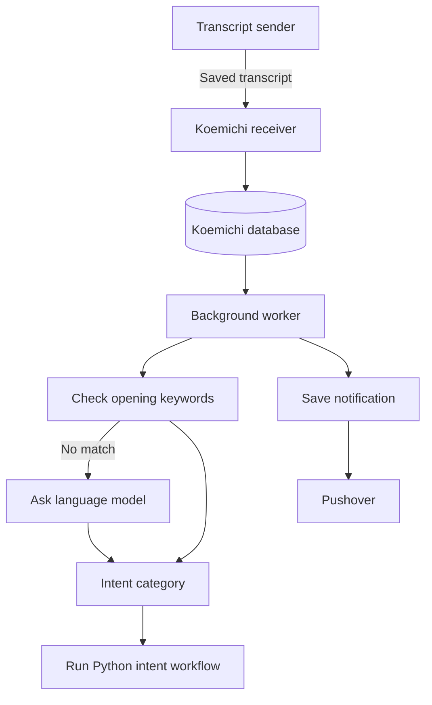

# Koemichi 🧭

**Koemichi classifies transcripts and runs their workflows in Python.** It accepts transcripts from [Koebako](https://github.com/divin/koebako) or any compatible sender; Koebako is the companion service that records and transcribes Pebble Index audio. The projects communicate through web requests and keep separate code and storage. Koemichi is tailored to my workflow, but its routing and workflow structure can serve as a foundation for your own project. The Japanese-inspired name joins *koe* (声, “voice”) and *michi* (道, “path” or “way”): a route for voice notes.

AI tools were used during the development of this project.

## 🧭 Architecture



Koemichi's receiver saves incoming transcripts to its SQLite database. A separate worker classifies and dispatches them, retries failures, and queues Pushover notices separately. A stable `note_id` lets Koemichi recognize repeated submissions. No code, database, or audio is shared with the sender.

## 🚀 Run with Compose

You need Docker Compose, a transcript sender, a reachable language-model service, and a reachable NoteDiscovery instance for memo workflows. Configure their addresses in `.env`, then run these commands from the Koemichi project directory.

```sh
cp example.env .env                  # Create your local configuration
# Replace sample values with your secrets and service addresses; never commit .env.
docker compose pull                 # Pull the published GHCR image
docker compose up -d                 # Start Koemichi
docker compose logs -f receiver worker # Follow service logs; Ctrl+C exits
```

On Linux, the container runs as UID/GID `1000:1000`. Make the host data directory writable by that user before starting; for the default `./data` directory, run:

```sh
mkdir -p ./data
sudo chown -R 1000:1000 ./data
```

If `HOST_DATA_DIR` points elsewhere, use that directory instead. This is needed for both a new database and existing database files because the bind mount hides the image's `/data` directory permissions.

The receiver is available on the host at `http://127.0.0.1:8001` by default and is not exposed publicly. `KOEMICHI_PORT` changes the host port, not the container port. If the transcript sender runs in another environment or Compose project, configure an address it can reach. The sample NoteDiscovery URL uses `host.docker.internal`; change it if NoteDiscovery is at another address. If NoteDiscovery is another container, ensure the worker can reach it on a shared Docker network.


## 🧰 NoteDiscovery MCP tools

The FastMCP server is an importable component at `koemichi.services.mcp.server.mcp`, not a separate Compose service. It exposes only the read-only `search_notes`, `list_notes`, and `get_note` tools to agents. Deterministic folder creation and note writes remain application-code operations through `NoteDiscoveryClient`. Set `NOTEDISCOVERY_API_URL` in the Koemichi worker environment to a reachable NoteDiscovery base URL.

## 📥 Transcript receiver

`POST /transcripts` accepts this JSON payload from Koebako or another compatible sender:

```json
{
  "schema_version": 1,
  "note_id": "stable-note-uuid",
  "source": "memo",
  "recorded_at_ms": 1760000000000,
  "transcript": "recognized words"
}
```

Authentication is optional. If `TRANSCRIPT_INGEST_TOKEN` is set, senders must provide `Authorization: Bearer <token>`; for Koebako, put the same value prefixed with `Bearer ` in `TRANSCRIPT_WEBHOOK_AUTH_VALUE`. If the token is unset, the receiver accepts requests without authentication. That is suitable only for trusted localhost use: Compose binds the receiver to `127.0.0.1` by default, so keep that binding if auth is disabled. The payload contains its format version, stable `note_id`, source, recording time in Unix milliseconds, and transcript text. The receiver responds `accepted` after saving a transcript or `duplicate` if that ID was already saved. Reusing an ID with different content returns HTTP `409`; unsupported versions and extra fields are rejected.

## 🧠 Classification and intent workflows

Koemichi checks the transcript's opening words for a keyword phrase. If none matches, it asks a configured large language model (LLM) to choose an intent. The model server uses the OpenAI API format but can run locally without an OpenAI account. These are the supported intents and matching opening words:

| Intent | Meaning | Starting words that select this intent |
|---|---|---|
| `journal` | Personal reflection or diary entry. | `journal`, `diary`, `tagebuch` |
| `todo` | An actionable task or reminder. | `todo`, `to-do`, `task`, `aufgabe` |
| `memo` | General note and fallback intent. | `memo`, `note`, `notiz`, `remember` |
| `research` | Request to look something up. | `research`, `recherche`, `look up`, `lookup`, `search` |

After classification, Koemichi runs the registered Python workflow for that intent. Memo and journal have Python handlers; `todo` and `research` are not implemented yet. Notes classified as an unimplemented intent are marked as an error. Koemichi does not send notes to n8n or use a webhook fallback.

Memo notes are written under `Memo/YYYY-MM-DD-title.md`. Journal entries use `Journal/YYYY/MM/YYYY-MM-DD.md`; the recording's local date is treated as today, but the previous day is preferred unless that journal file already exists. Existing destinations get a numbered suffix rather than being overwritten or appended to. The specialist agents only edit transcript wording; Python chooses paths, creates folders, and writes notes.
## 🤖 Example self-hosted intent classifier

My setup runs [`llama.cpp`](https://github.com/ggml-org/llama.cpp) in a separate Docker container as the LLM server. The sample `.env` uses `LLM_URL=http://llama-cpp:8080/v1`; set `LLM_MODEL_NAME` to the model loaded by your server. It must be reachable from the Koemichi worker. This is an external deployment choice; another server using the same API format can be used.

Empty transcripts default to `memo` without calling the model. Notes progress through `transcribed`, `routing`, `routed`, and `dispatched`, or reach `error` when retries are exhausted or an intent handler is not implemented. `dispatched` means the selected Python workflow completed.

## ⚙️ Configuration

| Variable | Required? | Purpose |
|---|---|---|
| `TRANSCRIPT_INGEST_TOKEN` | Optional | Long, random shared secret; when set, the transcript sender must use the same Bearer token. Unset disables receiver authentication and should be used only with the default localhost-only Compose binding. |
| `NOTEDISCOVERY_API_URL` | Memo/journal workflows and MCP tools | Base URL for NoteDiscovery, reachable from the Koemichi worker (and any process importing the MCP server). |
| `LLM_URL` | Worker | Required address of the model server used when no keyword matches. |
| `LLM_MODEL_NAME` | Worker | Required model name used for intent classification. |
| `NOTIFICATION_MODE` | No | `normal` by default; supported values are `normal`, `debug`, and `off`. |
| `PUSHOVER_API_TOKEN` | Unless notifications are off | Pushover application token. |
| `PUSHOVER_USER_KEY` | Unless notifications are off | Pushover user or group key. |
| `HOST_DATA_DIR` | Compose | Host folder for Koemichi's database; defaults to `./data`. |
| `DATA_DIR` | No | Container/local folder for Koemichi data; Compose uses `/data`, local runs default to `./data`. |
| `DATABASE_PATH` | Optional | Database file path; defaults to `${DATA_DIR}/koemichi.db`. |
| `TZ` | Optional | Timezone; defaults to `Europe/Berlin`. |

At startup, the worker checks that the model server and notification settings are configured. It contacts the model only when no starting keyword matches, but the model address and name must still be set. Pushover sends notifications to your devices; notifications are on by default, so provide its two credentials or set `NOTIFICATION_MODE=off`. To use notifications, create an application at [Pushover](https://pushover.net), then put its application token and your user or group key in `.env`.

## 🔔 Notifications, privacy, and storage

Pushover notifications are queued in SQLite and delivered by the worker with retries. Only the worker receives Pushover credentials. Notifications do not include transcript text; debug mode adds processing details. Since Koemichi receives a note only after transcription, its `received` notice means the transcript was accepted by Koemichi, not that a recording was just uploaded. Upload and transcription failures are handled by the sender, [Koebako](https://github.com/divin/koebako), which can send its own Pushover notifications. Audio remains with Koebako. Koemichi stores the transcript for routing and sends it to the classifier and the Python workflow for the selected intent.

| Mode | Notifications |
|---|---|
| `normal` | Regular notices when a transcript arrives and its Python workflow completes; an urgent notice for a final processing error. |
| `debug` | Regular notices plus quiet notices about processing, retries, and recovery; final errors remain urgent. |
| `off` | No notifications are queued or delivered; Pushover credentials are not required. |

Koemichi does not use Pushover's emergency/repeating priority for routine updates. Notifications may appear on a device lock screen, so treat them as private information.

Koemichi stores its SQLite database at `/data/koemichi.db`. It starts with a fresh database and does not import the older Koemichi database; back up any data you need and use a fresh data directory. Keep the database on a local disk and run one worker. Koemichi is designed for one user on one host.

Keep the transcript receiver private where possible. If the sender must reach it over an untrusted network, use HTTPS (encrypted traffic) and a long, randomly generated shared secret. Do not expose the database, model server, or NoteDiscovery administration interfaces to the public internet.

## 🧪 Development checks

For development, use Python 3.12, [`uv`](https://github.com/astral-sh/uv), and [`just`](https://just.systems/man/en/):

```sh
uv sync --dev # Install development dependencies
just        # Format, lint, and sort imports
just check  # Check types, formatting, and lint without changing files
just test   # Run the test suite
```
